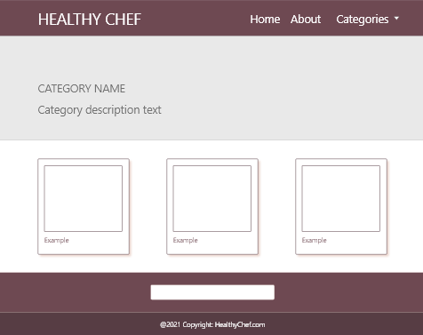
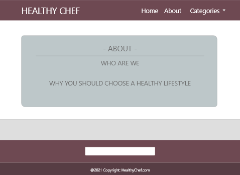

# recipes

Healthy recuoe website with responsive design. Includes such pages:

- Home page (featured recipes)

- Recipe page
  Contains basic information about a recipe (ingredients, time to make, calories, image and instructions)
  
- Categories page
  Displays all available categories

- Seperate category page
  Displays recipes that relate to this category

- About
  Socials, learn more about the company

**Planning:**
Prototypes for each page created with Adobe XD tools

Home:

Recipe:

Categories:

Recipes for category:

About:

  
